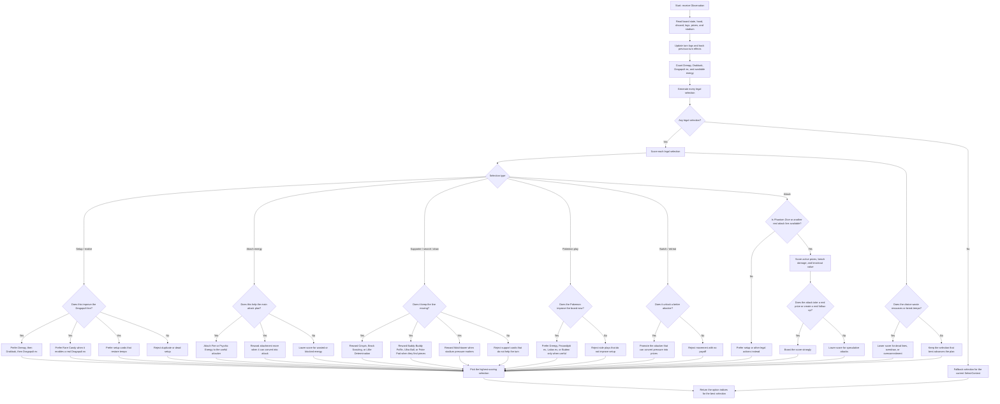

# Dragapult ELI5

This is the simple version of the Dragapult ex notebook agent, based on the
code in the kernel.

## What the agent is trying to do

This agent tries to keep a fast, aggressive tempo.

It does not think in terms of a long hidden plan. Instead, it reads the board,
checks what can be done now, scores every legal choice, and prefers the option
that moves the Dragapult line forward without wasting resources.

The basic question is:

1. Can I build the Dragapult line now?
2. Can I attack soon, or even this turn?
3. Can I use my support cards to keep the pressure going?

## What it looks at first

The code reads:

- the active and benched Pokemon on both sides;
- cards in hand, discard, stadium, and prize-relevant counts;
- how many Dreepy, Drakloak, and Dragapult ex are already in play;
- whether a Bench attacker is ready;
- whether there is enough energy for Phantom Dive;
- whether the previous turn created a real KO or item lock situation;
- how many prizes remain on each side.

## What it prefers

The agent gives higher scores to actions that keep the engine moving.

It likes:

- playing Dreepy early;
- evolving into Drakloak and then Dragapult ex;
- playing Rare Candy when it becomes a real Dragapult ex line;
- using Buddy-Buddy Poffin when it finds missing setup Pokemon;
- using Crispin when it creates a strong same-turn or next-turn line;
- using Brock Scouting or Lillie Determination when they restore useful tempo;
- attaching Fire or Psychic Energy to the Pokemon that actually matters;
- using Team Rocket Watchtower when stadium pressure matters;
- using Fezandipiti ex, Latias ex, or Meowth ex only when they help the
  current line instead of sitting there for no reason.

## How it chooses an attack

The code does not blindly attack.

It first checks whether Phantom Dive is legal, whether a Bench attacker can be
promoted, and whether the target board can actually be punished.

Then it scores possible attack lines by asking:

- does the active target give real Prize value?
- can the attack also set up bench damage counters?
- does the attack finish a knockout now?
- does the line preserve future pressure?

The agent prefers:

- Phantom Dive when it is the real main attack;
- a Bench attacker when the active attacker is not ready;
- a line that takes prizes now over a line that only looks good later;
- spreading damage when it creates a better multi-KO turn.

## What it avoids

The code tries to avoid slow or wasted turns.

It usually rejects:

- extra setup Pokemon when the line is already full;
- a Rare Candy line that does not improve the board;
- playing draw or search cards when the deck is already too thin;
- retreating when there is no better attacker to promote;
- over-attaching Energy to a Pokemon that cannot convert it;
- attacking if the attack does not really improve the prize race;
- keeping dragapult pieces in hand when they should already be on board.

## In very simple words

The agent is basically a tempo judge.

It looks at every legal move, asks "does this help me get to Dragapult ex and
real prizes faster?", gives it a score, and then picks the best score.

So the pattern is:

- set up the Dreepy/Drakloak/Dragapult line;
- use support cards only when they keep that line moving;
- attack when the attack actually matters.

## Execution diagram

