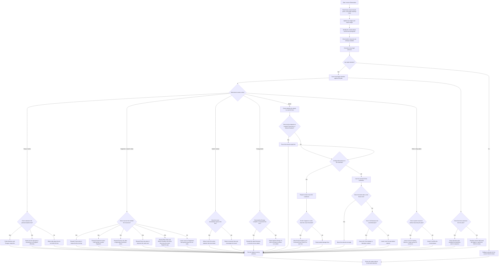

# Honchkrow/Porygon ELI5

This is the simple version of the Honchkrow/Porygon plan, written from the
code itself.

## What the agent is trying to do

The agent is trying to play like it has a checklist for each turn.

It does not just ask, "What is the strongest card right now?" It asks:

1. What phase am I in?
2. What line am I building?
3. What resources do I need to finish the line?
4. Can I reach a real Knock Out this turn?

The code keeps a turn ledger and a match ledger, so it can remember what it is
trying to finish instead of making each choice in isolation.

## What it looks at first

The agent reads the public board and checks:

- which Pokémon are active and on the Bench;
- how many Team Rocket Supporters are visible in hand, discard, and Prize;
- whether Honchkrow, Murkrow, Porygon, or Porygon2 are already in play;
- whether Ignition Energy, Factory, Ariana, Petrel, Transceiver, Roto-Stick,
  or Miracle Headset can actually help this turn;
- whether the opponent has a visible Mega Abomasnow ex or other matchup
  evidence that changes the line.

## What it prefers

The main idea is:

1. Build the attacker line.
2. Secure the Supporters needed for the Knock Out.
3. Only then spend extra resources.

The code prefers:

- Murkrow and Porygon setup before random side plays;
- Proton early when it keeps the line moving;
- Transceiver when it can still fetch a useful Supporter;
- Factory only when there is a real draw conversion after Supporter play;
- Petrel only when it leads to a better same-turn result;
- Roto-Stick only when revealed cards can close a Supporter gap;
- Miracle Headset only when it restores exactly the missing Supporters for a
  real KO line;
- switching or retreating only when it immediately improves the current line;
- Ignition Energy only when it completes an actual attack this turn.

## What it avoids

The agent blocks actions that look active but do not help the plan.

It avoids:

- spending the last useful Supporter too early;
- using Factory before there is a legal draw conversion;
- promoting a Pokémon that cannot attack usefully;
- retreating just to move pieces around;
- using Hacking;
- using Deceit unless the attack damage or interruption is actually decisive;
- attaching Ignition Energy if it does not lead to an attack;
- sending Articuno into the plan unless the matchup really asks for it.

## Special case: Mega Abomasnow ex

Against Mega Abomasnow ex, the code gets stricter.

It treats partial damage as not good enough. The attack or retreat has to
produce a real Knock Out path now, not just "maybe next turn."

That is why the code:

- requires enough Supporters before Rocket Feathers;
- requires a much larger Supporter count before R Command against Mega
  Abomasnow ex;
- checks exact discard counts when that is the committed KO line;
- refuses attacks that look close but do not actually finish the job;
- allows retreat only if the replacement attacker can immediately convert.

## In very simple words

The agent is a planner, not a button-masher.

It tries to:

- set up the right attacker;
- keep enough resources for the finish;
- spend search and draw cards only when they move the plan forward;
- and attack only when the attack is part of a real KO line.

So the whole idea is: "build the line, protect the resources, then cash it in."

## Execution diagram

