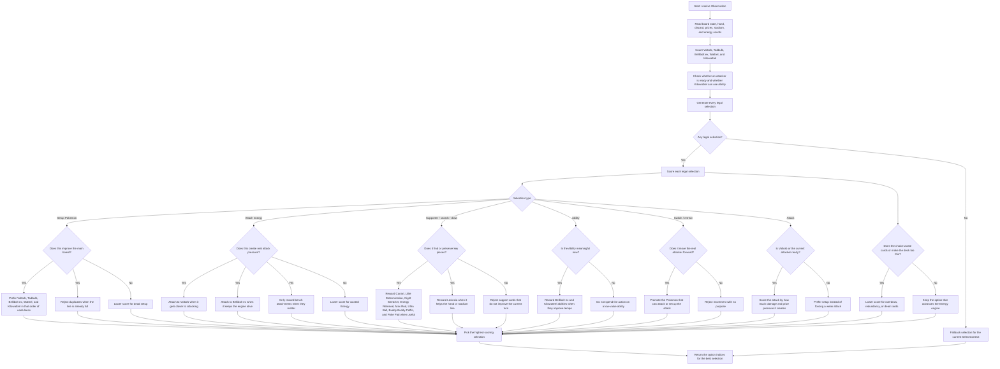

# Iono ELI5

This is the simple version of the Iono's Deck notebook agent, based on the
code in the kernel.

## What the agent is trying to do

This agent tries to build one big Energy engine around Iono's Pokemon.

It does not just ask "what is the strongest card?" It asks:

1. Can I set up Voltorb, Bellibolt ex, and Kilowattrel?
2. Can I attach enough Energy to make Voltorb attack hard?
3. Can I use search, draw, or Ability effects to keep the hand alive?

The code scores every legal action and prefers the one that supports the
current setup or attack plan.

## What it looks at first

The code reads:

- the active and benched Pokemon on both sides;
- how much Energy is already in play;
- how many Voltorb, Tadbulb, Bellibolt ex, Wattrel, and Kilowattrel are visible;
- whether Kilowattrel can use its Ability;
- whether Voltorb is close to becoming a real attacker;
- whether the deck is getting too thin;
- whether a Stadium is already in play;
- how many support cards and search cards are available.

## What it prefers

The agent gives higher scores to actions that turn the board into a real
Voltaic Chain turn.

It likes:

- setting up Voltorb early;
- getting Tadbulb and Bellibolt ex into play;
- getting Wattrel and Kilowattrel into play;
- attaching Energy to Voltorb or Bellibolt ex when that actually matters;
- using Bellibolt ex's Ability when it loads the board with Energy;
- using Canari when it still finds missing setup pieces;
- using Levincia when it helps the hand or stadium line;
- using Lillie Determination, Night Stretcher, Energy Retrieval, Max Rod,
  Buddy-Buddy Poffin, Ultra Ball, or Poke Pad when they recover the exact
  pieces the turn needs.

## How it chooses an attack

The code checks whether Voltorb is ready to attack and whether the active
Pokemon can be converted into the real damage line.

It prefers:

- Voltaic Chain when the Energy count makes it meaningful;
- Voltorb as the main attacker;
- Bellibolt ex as the Energy engine, not just a random bench piece;
- a switch or retreat only when it promotes the Pokemon that actually attacks.

The attack is usually the last step in the turn, so the code scores attacks as
the final conversion of the setup.

## What it avoids

The code tries to avoid clutter and bad trades.

It usually rejects:

- duplicate setup Pokemon when the line is already full;
- Energy attachments that do not improve the attack;
- support cards that do not help the current setup;
- drawing too aggressively when the deck is already low;
- retreating just to shuffle pieces around;
- playing a Pokemon if it does not increase the useful board count;
- using cards that are active in isolation but do not move the Voltorb line
  forward.

## In very simple words

The agent is basically an Energy builder.

It looks at every legal move, asks "does this make the Voltorb line stronger
or more complete?", gives it a score, and then picks the best score.

So the pattern is:

- build Voltorb, Bellibolt ex, and Kilowattrel;
- attach Energy where it creates real pressure;
- use draw and search only when they keep the engine alive;
- attack when Voltorb is ready.

## Execution diagram

