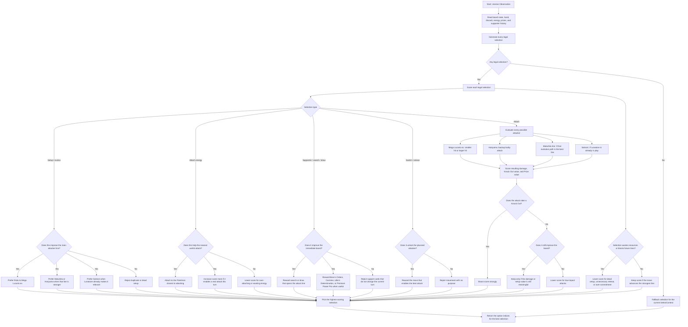

# Mega Lucario ELI5

This is the simple version of the Mega Lucario ex notebook agent, based on
the code in the kernel.

## What the agent is trying to do

This agent is much simpler than Honchkrow.

It does not keep a deep turn ledger or a long plan. Instead, it looks at the
current board, gives every legal choice a score, and picks the best scored
options.

The basic question is:

1. Which move helps the board most right now?
2. Which move helps Mega Lucario ex attack soonest?
3. Which move makes the current attack better?

## What it looks at first

The code reads:

- the active and benched Pokémon on both sides;
- cards in hand and discard;
- attached energy counts;
- whether it can switch, retreat, evolve, attach, or attack;
- how many Prizes are left;
- whether a Supporter has already been played this turn.

## What it prefers

The agent gives higher scores to actions that help Mega Lucario ex do work.

It likes:

- evolving Riolu into Mega Lucario ex;
- building Hariyama or Makuhita when that attacker is the better line;
- using Solrock when it is the lighter attacker that fits the board;
- attaching Fighting Energy to the Pokémon that is closest to attacking;
- playing search or draw cards when they improve the hand;
- using Switch when it unlocks the planned attacker;
- playing Boss's Orders, Carmine, Lillie's Determination, or Premium Power
  Pro when they look useful in the current state.

## How it chooses an attack

The code does not hardcode one move.

It tries to predict the best current attack for each possible attacker:

- Mega Lucario ex can attack for either a smaller or larger hit;
- Hariyama can attack as the bulkier backup;
- Makuhita can be evolved into that line if needed;
- Solrock becomes relevant when Lunatone is already in play.

Then it scores the board state after each possible attack:

- more damage is better;
- taking a Knock Out is much better;
- taking more Prize value is better;
- attacking the active Pokémon is usually better than hitting a Bench target
  unless the target switch line is better.

## What it avoids

The code tries to avoid wasting cards on dead lines.

It usually rejects:

- duplicate setup Pokémon when the line is already filled;
- a search target that does not improve the board;
- extra Energy on a Pokémon that is already above its useful attack cost;
- switching for no reason;
- retreating when it does not help the attack line;
- playing support cards that do not improve the immediate score.

## In very simple words

The agent is basically a judge with a score sheet.

It looks at every legal move, asks "how useful is this for Mega Lucario right
now?", gives it a number, and then picks the best number.

So the pattern is:

- score the legal options;
- prefer the move that builds or enables the best attacker;
- attack with the line that looks strongest on the current board.

## Execution diagram

