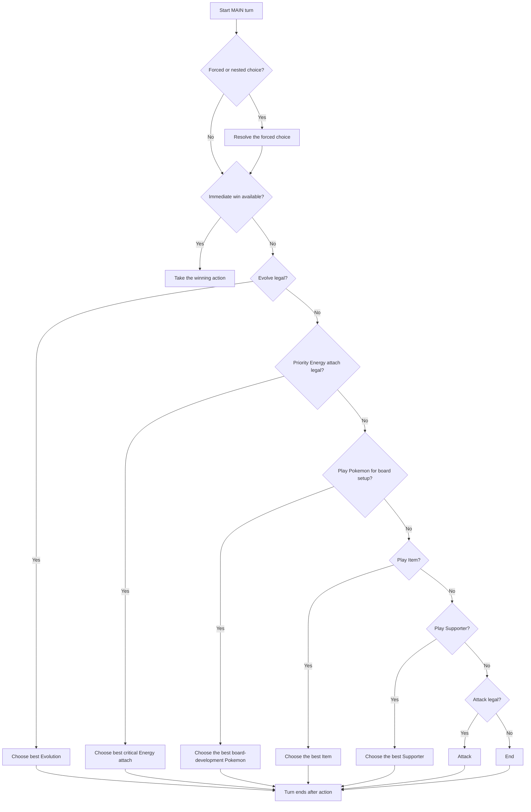

# Turn Algorithm, ELI5

This is the short version of how the agent plays one `MAIN` turn.

## Big Idea

The agent does not compare all actions in one pile. It walks through a fixed
order of phases and always takes the first legal action in the earliest useful
phase.

## Turn Flow

1. If the game forces a nested choice, solve that first.
2. If there is an immediate winning action, take it.
3. In `MAIN`, check phases in order:
   - evolve
   - attach Energy that matters most
   - play Pokemon for board development
   - play Items
   - play Supporters
   - attack
   - end only if nothing better is left
4. Inside a phase, use scoring only to pick the best target or best option.
5. If an attack is chosen, the turn ends right there.

## Simple Rules

- Evolution comes before Energy when both are legal.
- Useful board setup comes before generic pass-like actions.
- Items come before Supporters.
- A terminal attack ends the turn.
- If a phase has no legal action, the agent skips it and checks the next one.

## One Sentence Summary

The agent tries to set up the board first, attack last, and never keeps acting
after attacking.

## Flowchart

